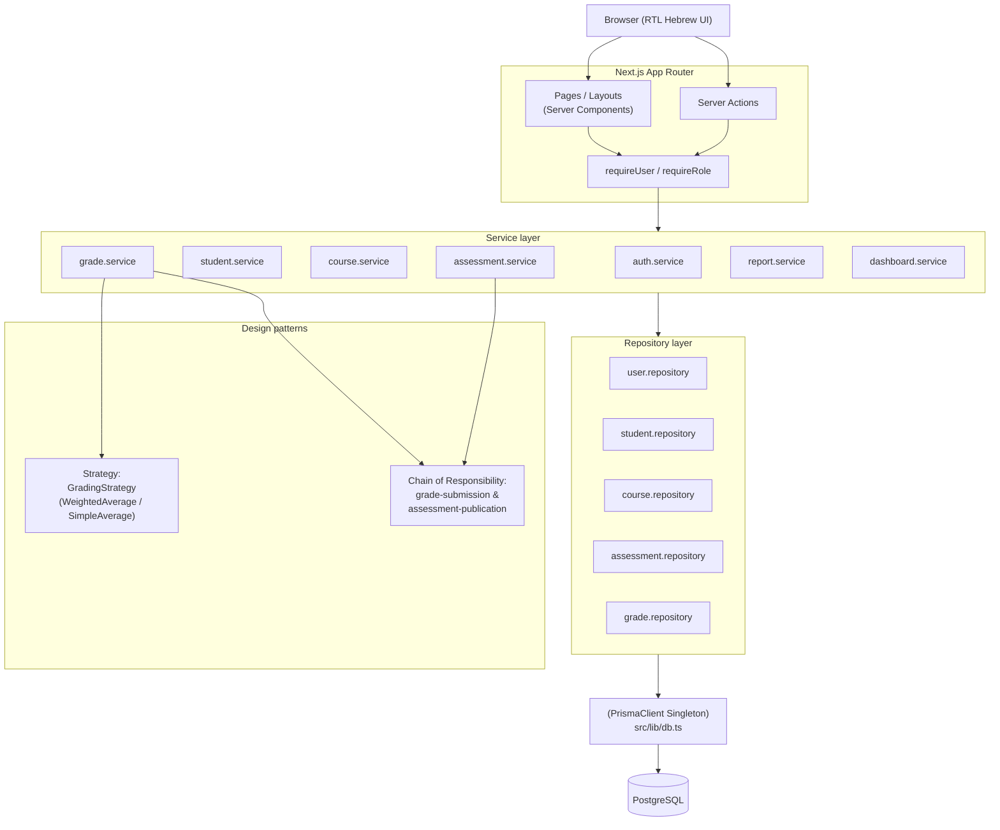

# Architecture

## Overview

GradeFlow is a server-rendered Next.js (App Router) application. Almost every screen is a React Server Component that reads directly from the service layer; interactivity (forms, grade entry, confirmations) is handled by small Client Components calling Next.js Server Actions. There is no separate REST/GraphQL API layer — Server Actions *are* the API, and they run the same permission and validation code as the pages that render the data.

```
Browser
  │  (HTTP / React Server Components / Server Actions)
  ▼
Next.js App Router  (src/app)
  │  route guards: requireUser() / requireRole()
  ▼
Services            (src/services)      ← business rules, permissions
  │            uses ↓                 ↓ uses
  │     patterns/grading        patterns/validation
  │   (Strategy: final grade)  (Chain of Responsibility:
  │                              grade submission / publish)
  ▼
Repositories        (src/repositories)  ← Prisma queries only
  ▼
Prisma Client (singleton, src/lib/db.ts)
  ▼
PostgreSQL
```

## Folder structure

```
src/
  app/                    Next.js routes (App Router)
    login/                Public: login page, form, Server Actions
    (app)/                Route group: every authenticated screen,
                           wrapped by layout.tsx which calls requireUser()
      dashboard/
      students/            admin-only student management
      courses/
        [id]/
          assessments/     nested assessment CRUD + publish/delete
            [assessmentId]/grades/   bulk grade entry
            [assessmentId]/edit/
          final-grades/    computed final grades for a course
          edit/
      reports/
        course/[id]/       printable course report
        student/[id]/      printable student report card
      settings/
  components/
    ui/                    generic, reusable primitives (Button, Card,
                           Field, Badge, Alert, EmptyState, ...)
    layout/                AppShell (sidebar/topbar), PageHeader, nav items
  domain/
    errors.ts              DomainError subclasses + toUserMessage()
  lib/
    db.ts                  Prisma Client Singleton
    auth/                  session.ts (JWT cookies), password.ts (bcrypt)
    utils.ts                cn(), formatGrade(), formatDate()
    formState.ts            shared useActionState result type
  patterns/
    grading/                Strategy pattern (final grade calculation)
    validation/              Chain of Responsibility (write-path validation)
  repositories/             one file per aggregate root - Prisma access only
  services/                 one file per aggregate root - business rules,
                            permission checks, orchestration
  validation/               Zod schemas (one per form/entity)
  generated/prisma/         generated Prisma Client (git-ignored)
prisma/
  schema.prisma
  migrations/
  seed.ts
tests/
  unit/
docs/
```

## Dependency flow (why it's layered this way)

1. **Pages/Server Actions depend on services, never on repositories or Prisma directly.** This keeps permission checks and business rules in one place (the service), so the same rule can't accidentally be skipped by a page that queries the database directly.
2. **Services depend on repositories and on the two pattern modules.** A service like `grade.service.ts` doesn't know *how* the weighted average is computed (that's `patterns/grading`) or *how* the chain of checks is wired (that's `patterns/validation`) - it just calls them.
3. **Repositories depend only on the Prisma singleton.** They are thin, intention-revealing wrappers (`findEnrolledInCourse`, `sumPublishedWeight`, ...) - if GradeFlow ever needed to swap Prisma for something else, only this layer would change.
4. **`patterns/validation` depends on small ports (`ports.ts`), not on repositories directly.** The concrete adapters live in `services/validationPorts.ts`. This is what makes the Chain of Responsibility handlers unit-testable with in-memory fakes (see `tests/unit/validation-chain.test.ts`) instead of requiring a live database.

## Authentication & route protection

There is no `middleware.ts`/`proxy.ts` in this project by design: with the App Router, a single async layout (`src/app/(app)/layout.tsx`) that calls `requireUser()` before rendering *any* child route is sufficient, simpler to reason about, and runs on the Node.js runtime (so bcrypt/jose work without edge-runtime restrictions). `requireRole(...)` is used additionally on admin-only pages (e.g. `/students`). Every service method that performs a write independently re-checks the actor's role/assignment before touching the database - route guards and service guards are two independent layers, not one.

## Data flow example: entering a grade

1. `app/(app)/courses/[id]/assessments/[assessmentId]/grades/page.tsx` (Server Component) calls `gradeService.getGradeSheet(courseId, assessmentId)` after `courseService.getByIdForActor(user, id)` has already confirmed the signed-in user may see this course.
2. The page renders `<GradeEntryTable>` (Client Component), pre-filled with each enrolled student's current score.
3. On submit, the bound Server Action `saveGradeSheetAction` parses `FormData` into `{ studentId, score, feedback }[]` and calls `gradeService.submitBulkGrades(actor, { courseId, assessmentId, entries })`.
4. For each entry, the service runs the grade-submission Chain of Responsibility (`Authorization → Enrollment → Assessment → GradeRange`) before writing anything.
5. `gradeRepository.upsertOrClear(...)` persists (or deletes, for a cleared grade) the row.
6. `revalidatePath(...)` refreshes the grade sheet, the course's final-grades page, and the course detail page.

## Mermaid diagram


