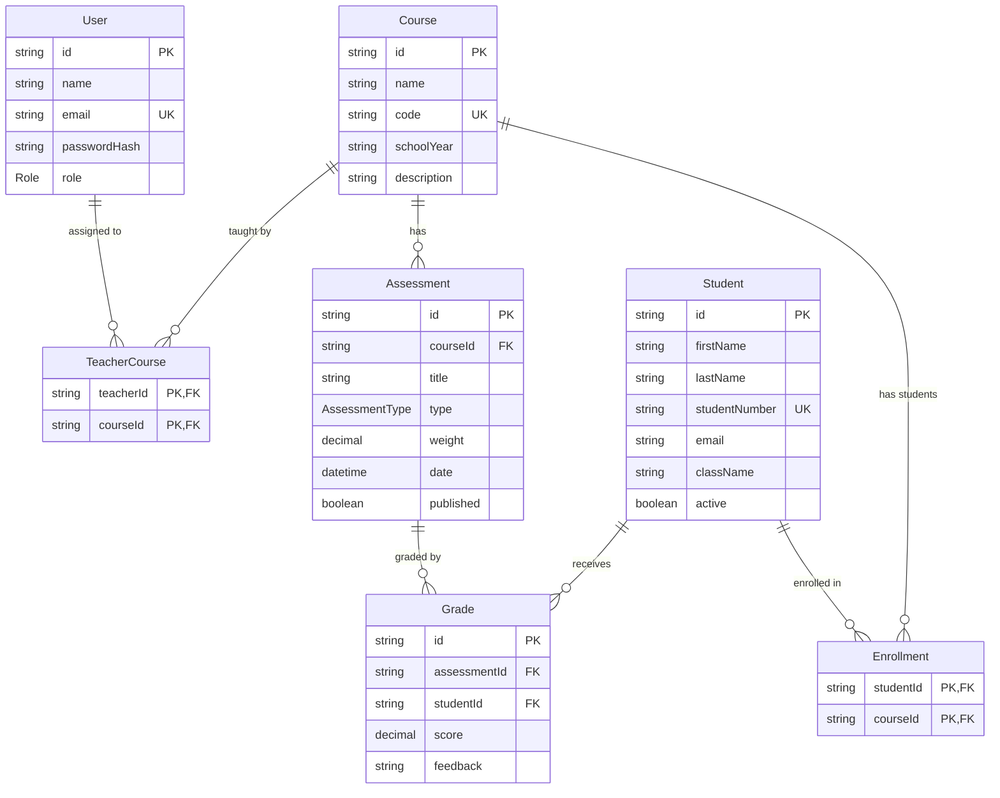

# Database

GradeFlow uses PostgreSQL with Prisma ORM 7. The schema lives in `prisma/schema.prisma`; migrations are tracked in `prisma/migrations/`.

## Entities

### `User`
An account that can log in — either an `ADMIN` or a `TEACHER`. Passwords are stored as bcrypt hashes (`passwordHash`), never in plain text.

| Field | Type | Notes |
|---|---|---|
| id | String (cuid) | PK |
| name | String | |
| email | String | unique |
| passwordHash | String | bcrypt hash |
| role | Role enum | `ADMIN` \| `TEACHER` |
| createdAt / updatedAt | DateTime | |

### `Student`
A pupil who can be enrolled in courses and graded. Not a login account.

| Field | Type | Notes |
|---|---|---|
| id | String (cuid) | PK |
| firstName / lastName | String | |
| studentNumber | String | unique |
| email | String? | optional |
| className | String | e.g. `ט'1` |
| active | Boolean | default true; deactivated students are excluded from active-student counts and enrollment pickers |
| createdAt / updatedAt | DateTime | |

### `Course`
A subject/class for a school year, e.g. "מתמטיקה" for `תשפ"ו`.

| Field | Type | Notes |
|---|---|---|
| id | String (cuid) | PK |
| name | String | |
| code | String | unique, e.g. `MATH-9` |
| schoolYear | String | |
| description | String? | optional |
| createdAt / updatedAt | DateTime | |

### `TeacherCourse` (join table)
Which teacher(s) are assigned to which course(s). Composite PK `(teacherId, courseId)` - a teacher can be assigned to a course at most once, and Prisma's `upsert` makes assignment idempotent.

### `Enrollment` (join table)
Which student(s) are enrolled in which course(s). Composite PK `(studentId, courseId)`.

### `Assessment`
One graded component of a course's grading scheme (exam, quiz, assignment, project, participation, other).

| Field | Type | Notes |
|---|---|---|
| id | String (cuid) | PK |
| courseId | String | FK → Course, `onDelete: Cascade` |
| title | String | |
| type | AssessmentType enum | `EXAM` \| `QUIZ` \| `ASSIGNMENT` \| `PROJECT` \| `PARTICIPATION` \| `OTHER` (Hebrew labels in `src/validation/assessment.schema.ts`) |
| weight | Decimal(5,2) | `0 < weight <= 100` (enforced by Zod at the API boundary) |
| date | DateTime | |
| description | String? | optional |
| published | Boolean | default false; only published assessments count toward a course's final grades |
| createdAt / updatedAt | DateTime | |

### `Grade`
One student's score on one assessment.

| Field | Type | Notes |
|---|---|---|
| id | String (cuid) | PK |
| assessmentId | String | FK → Assessment, `onDelete: Cascade` |
| studentId | String | FK → Student, `onDelete: Cascade` |
| score | Decimal(5,2) | `0 <= score <= 100` |
| feedback | String? | optional free-text note |
| createdAt / updatedAt | DateTime | |

`@@unique([assessmentId, studentId])` - a student has at most one grade per assessment; re-submitting overwrites it (`upsert`), and a missing row means "not graded yet" rather than an implicit zero.

## Relationships

- `User` (TEACHER) —< `TeacherCourse` >— `Course`  (many-to-many)
- `Student` —< `Enrollment` >— `Course`  (many-to-many)
- `Course` —< `Assessment`  (one-to-many)
- `Assessment` —< `Grade` >— `Student`  (many-to-many via Grade, with extra columns `score`/`feedback`)

## Indexes & constraints

- `User.email`, `Student.studentNumber`, `Course.code` are unique.
- `User.role`, `Student.active`, `Student.className`, `Course.schoolYear` are indexed for common filters.
- `TeacherCourse` and `Enrollment` index their `courseId` (the side most frequently queried: "who's in/teaching this course").
- `Assessment.courseId` and `Grade.studentId` are indexed.
- All foreign keys cascade on delete: removing a course removes its assessments, enrollments and teacher assignments; removing an assessment or student removes their grades. This keeps the database consistent without requiring application-level cleanup code.

## ERD

## Migrations

Generated with `prisma migrate dev` during development; deployed with `prisma migrate deploy`. See `prisma/migrations/` for the history — the initial migration (`_init`) creates the full schema described above in one step.
